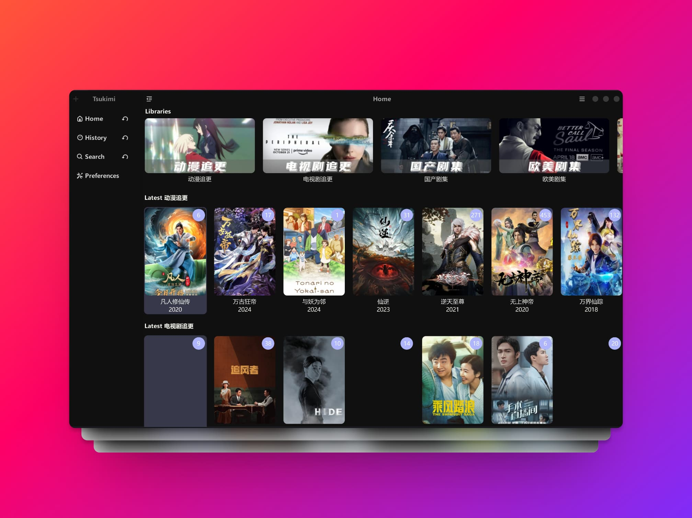
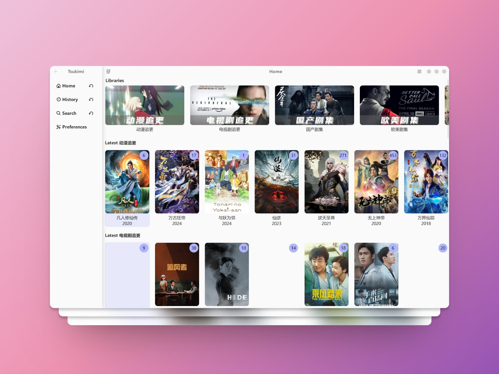

# Tsukimi       
<div align="center">

</div>

> A Simple and Easy to use Emby client.


  
Tsukimi 是使用 GTK4-RS 编写的第三方 Emby 客户端，目前兼容Linux和Windows。              

项目正在积极开发中，可能存在诸多bug和不稳定的情况，亦有相关功能缺失。如有建议，请移步Issues反馈。

<a href="https://github.com/tsukinaha/tsukimi/actions/workflows/build_linux.yml">

</a>
<a href="https://github.com/tsukinaha/tsukimi/actions/workflows/build_release.yml">

</a>
<a href="https://aur.archlinux.org/packages/tsukimi-git">

</a>

## 免责声明

- 本项目仅为使用Emby的公开API实现的客户端软件，不提供任何版权内容服务。
- 本项目使用GPL-3.0许可证，请在相关约定下使用。

## 软件截图（相关内容仅作展示）
<div align="center">


</div>

## 构建
### Linux
- 需要libadwaita、gtk4、mpv等相关库
- 具体参考 [Dockerfile](https://github.com/tsukinaha/tsukimi/blob/main/Dockerfile)
### Windows
- 使用Mingw GNU工具链
- 安装相关库
  - mingw-w64-x86_64-gcc
  - mingw-w64-x86_64-gtk4
  - mingw-w64-x86_64-libadwaita
  - mingw-w64-x86_64-mpv
  - mingw-w64-x86_64-pkgconf

## 安装
### Linux
目前不提供预构建的二进制/安装包，请用AUR自行安装。

### Windows
- 通过Scoop安装
```
scoop bucket add scol https://github.com/Kosette/scol.git
scoop install tsukimi
```
- 使用预编译的程序包
  请至[最新的Release](https://github.com/tsukinaha/tsukimi/releases/latest)下载，解压缩运行bin文件夹下tsukimi.exe，无须安装。

## 软件设置项
1. Proactively provide progress updates
开启后软件将每10s向服务器传输当前播放进度，关闭后，每300s传输一次进度
2. Sidebar overlay
设置是否固定侧栏
3. Background height
设置详情页海报背景的高度
4. Show Playing Window immediately
立刻打开播放器窗口
5. Resume playing
开启后将从已有进度播放，关闭时总是从头开始播放
6. HTTP Proxy
使软件使用http代理请求，格式`http://127.0.0.1:8080`

## MPV播放器配置
Tsukimi内置的MPV播放器使用默认配置，如果有自定义的需求，请遵循以下方法：
- Linux: 读取默认配置 (`$XDG_CONFIG_HOME/mpv`)
- Windows: 
首先读取以下路径中的配置
```
|__bin\
|__share\
|__lib\
|__mpv\
|    |__mpv.conf
|    |__input.conf
|    |__scripts\
|    |    |__ .......
|    |__ .......
|__config\
```
如果未配置，则保持libmpv默认行为 (优先级：`tsukimi`>`$MPV_HOME`>`%APPDATA%/mpv`)
**具体配置请见:[MPV-manual#files](https://mpv.io/manual/master/#files)** 

### 配置包
可以使用各类MPV配置包，Tsukimi不负责兼容任何超出MPV默认配置方案的定制包。新手可以使用 [Windows MPV Config懒人包](https://github.com/ZBound/mpv_config/raw/main/tsukimi-mpv-config.7z)
如有定制需求，请参考mpv的[配置文档](https://mpv.io/manual/stable/)


## 软件主题

- 软件内置了6款主题以及跟随系统配色的选项，同时尊重用户自定义 css 样式表 [了解详情](https://wiki.archlinux.org/title/GTK#Configuration)
- 主题来自 [Gradience](https://github.com/GradienceTeam/Gradience)

## 致谢 / Credits
- [gtk4-rs](https://github.com/gtk-rs/gtk4-rs)
- [MPV](https://github.com/mpv-player/mpv)
- [Adwaita](https://gitlab.gnome.org/GNOME/libadwaita/)
