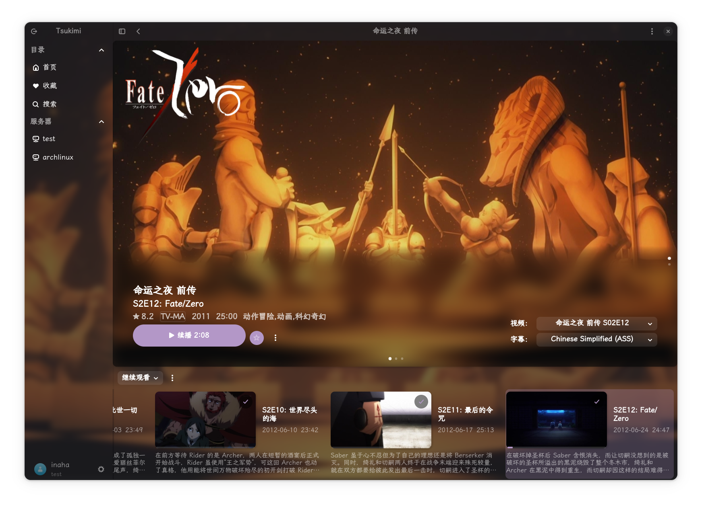
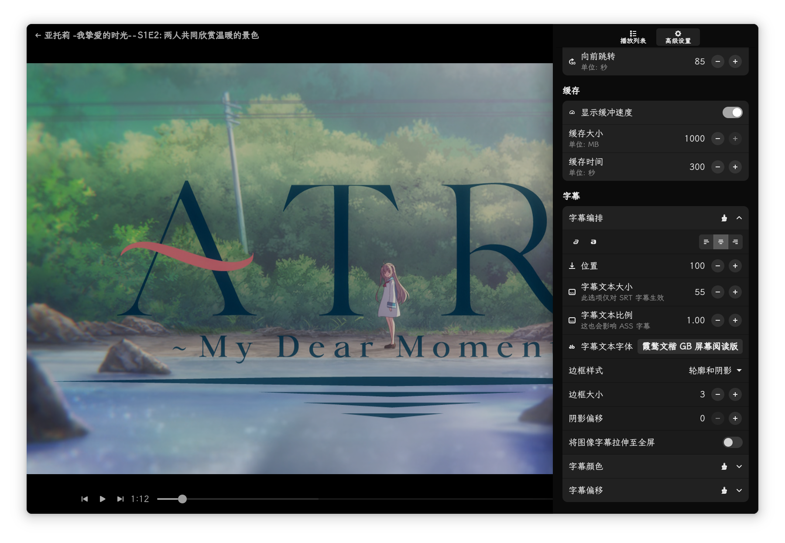

    

## Tsukimi
Tsukimi is a simple third-party Emby client written in GTK4-RS, uses MPV as the video player, and GStreamer as the music player

## Frequently Asked Questions
https://dev.tsukinaha.org/tsukimi

## Screenshots

 

 

## Installation
### Native package

 

## MPV Config
[MPV-manual#files](https://mpv.io/manual/master/#files) 

## Contributing

### Translations

If you'd like to help translating **Tsukimi** into your language, please head over to [Weblate](https://hosted.weblate.org/projects/tsukimi/).

## Build
[Build On Linux](./docs/build_on_linux.md)

## Credits
- [gtk4-rs](https://github.com/gtk-rs/gtk4-rs)
- [MPV](https://github.com/mpv-player/mpv)
- [Adwaita](https://gitlab.gnome.org/GNOME/libadwaita/)

## Thanks
- Gnome Music
- Fractal
- Clapper

## Disclaimer
The developers of this application does not have any affiliation with the content providers available.

## Star History

<a href="https://star-history.com/#tsukinaha/tsukimi&Timeline">
 <picture>
   <source media="(prefers-color-scheme: dark)" srcset="https://api.star-history.com/svg?repos=tsukinaha/tsukimi&type=Timeline&theme=dark" />
   <source media="(prefers-color-scheme: light)" srcset="https://api.star-history.com/svg?repos=tsukinaha/tsukimi&type=Timeline" />
   
 </picture>
</a>

