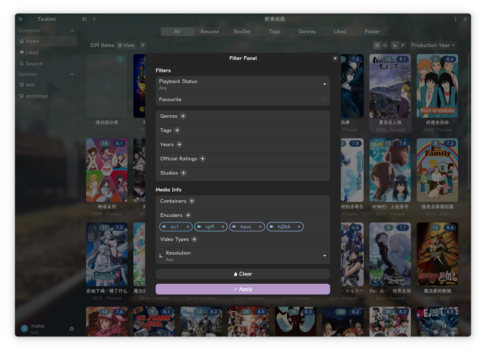

# tsukimi
A simple third-party Jellyfin client for Linux.

[](https://t.me/tsukimi_frying_crab)    [](https://github.com/tsukinaha/tsukimi/actions/workflows/build_linux.yml) [](https://flathub.org/apps/details/moe.tsuna.tsukimi) [](https://github.com/tsukinaha/tsukimi/wiki)


## About
A simple third-party Jellyfin client written in GTK4-RS, uses MPV as the video player, and GStreamer as the music player.

It’s also partially compatible with Emby.    
All of basic functions and most of admin functions are supported.    

You can play music and albums, as well as videos with more advanced settings.

## Screenshots
<div align="center">
 
</div>
<div align="center">
 
</div>
<div align="center">
 
</div>

## Installation

<a href="https://flathub.org/apps/details/moe.tsuna.tsukimi">

</a>

### Native Packages
[](https://repology.org/project/tsukimi/versions)

### Arch Linux
```bash
# AUR release (https://aur.archlinux.org/packages/tsukimi-bin)
paru -S tsukimi-bin

# AUR latest commit (https://aur.archlinux.org/packages/tsukimi-git)
paru -S tsukimi-git

# archlinuxcn repo https://github.com/archlinuxcn/repo/blob/master/archlinuxcn/tsukimi-git/PKGBUILD
sudo pacman -Syu tsukimi-git
```

### AOSC OS
```bash
sudo oma install tsukimi
```

### Gentoo Linux
```bash
sudo eselect repository enable gentoo-zh
sudo emerge --sync gentoo-zh
sudo emerge --ask media-video/tsukimi
```

### Nix
`tsukimi` is available in nixpkgs since 24.11. 

### Source code
[Build on Linux](./docs/build_on_linux.md)

## MPV Config
[MPV-manual#files](https://mpv.io/manual/master/#files) 

## Contributing

### Translations

If you'd like to help translating **Tsukimi** into your language, please head over to [Weblate](https://hosted.weblate.org/projects/tsukimi/).   

<a href="https://hosted.weblate.org/engage/tsukimi/">

</a>

## Disclaimer
The developers of this application does not have any affiliation with the content providers available.

## License
tsukimi is licensed under the [GPLv3](https://www.gnu.org/licenses/gpl-3.0.html) license.

Thanks to open-source projects like GNOME Music, Fractal, and Clapper—we referenced a lot from them during development, and everyone who contributed code or translations!

### Credits
- [GTK4-RS](https://github.com/gtk-rs/gtk4-rs)
- [MPV](https://github.com/mpv-player/mpv)
- [Adwaita](https://gitlab.gnome.org/GNOME/libadwaita/)

<sup>
Fonts used in screenshots: <a href="https://github.com/lxgw/LxgwWenKai-Screen">LXGW WenKai Screen</a> 
<br />
Anime in screenshots: <a href="https://www.fate-zero.jp/">Fate/Zero</a>
</sup>

