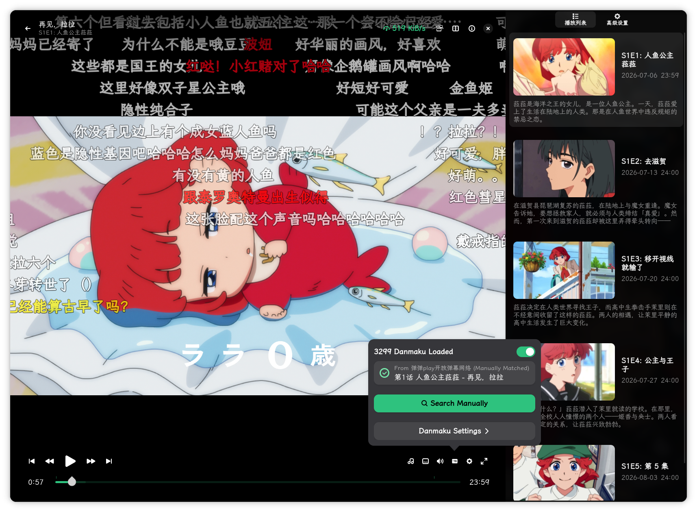
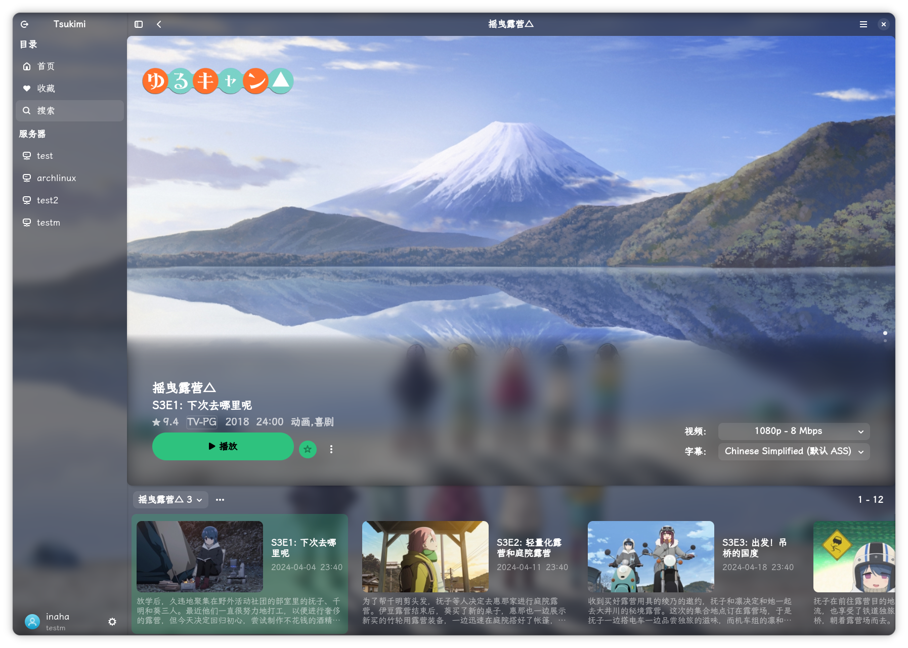
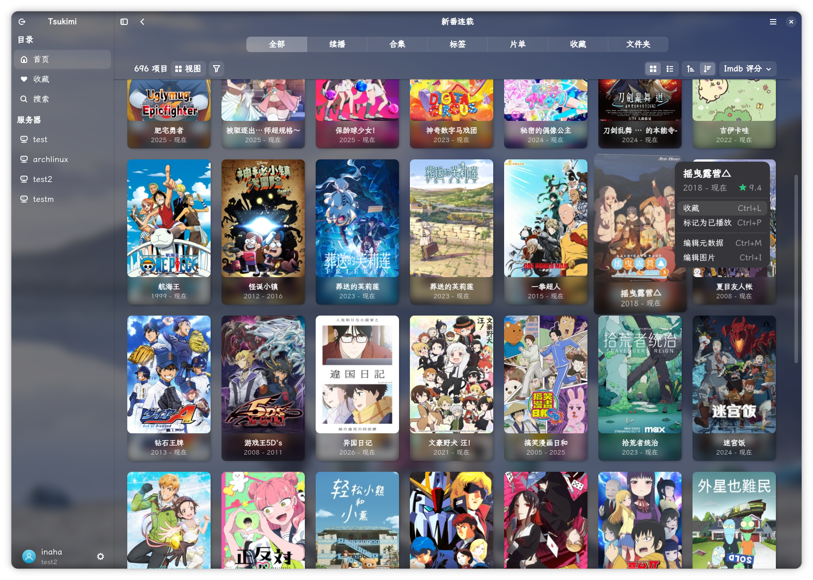

# tsukimi
A simple third-party Jellyfin client for Linux.

> We use wl-proxy for mpv gpu-next vo embedding, you can find the embedder [here](https://github.com/MutsumiUniverse/Mutsumi). We also made a local player [Fughetta](https://github.com/MutsumiUniverse/Fughetta) by this embedder.

<p align="left">
    <a href="https://matrix.to/#/#tsukimi:matrix.org"></a>
    <a href="https://t.me/tsukimi_frying_crab"></a>
    <a href="https://github.com/tsukinaha/tsukimi/wiki"></a>
    <a href="https://hosted.weblate.org/engage/tsukimi"></a>
    <a href="https://github.com/tsukinaha/tsukimi/blob/main/LICENSE"></a>
    <a href="https://flathub.org/apps/details/moe.tsuna.tsukimi"></a>
</p>

## Screenshots
<div align="center">
 
</div>
<div align="center">
 
</div>
<div align="center">
 
</div>

## Installation

<a href="https://flathub.org/apps/details/moe.tsuna.tsukimi">

</a>

### Native Packages
[](https://repology.org/project/tsukimi/versions)

### Fedora
```bash
sudo dnf copr enable walker874/tsukimi
sudo dnf install tsukimi
```

### Arch Linux
```bash
# AUR release (https://aur.archlinux.org/packages/tsukimi-bin)
paru -S tsukimi-bin

# AUR latest commit (https://aur.archlinux.org/packages/tsukimi-git)
paru -S tsukimi-git

# archlinuxcn repo https://github.com/archlinuxcn/repo/blob/master/archlinuxcn/tsukimi/PKGBUILD
sudo pacman -Syu tsukimi

# archlinuxcn repo https://github.com/archlinuxcn/repo/blob/master/archlinuxcn/tsukimi-git/PKGBUILD
sudo pacman -Syu tsukimi-git
```

### AOSC OS
```bash
sudo oma install tsukimi
```

### Gentoo Linux
```bash
sudo eselect repository enable gentoo-zh
sudo emerge --sync gentoo-zh
sudo emerge --ask media-video/tsukimi
```

### Nix
`tsukimi` is available in nixpkgs since 24.11.

## MPV Config
[MPV-manual#files](https://mpv.io/manual/master/#files)

## Contributing
Please, follow the [contribution guide](./CONTRIBUTING.md) to know how to
start contributing to Tsukimi.

## Disclaimer
The developers of this application does not have any affiliation with the content providers available.

## License
tsukimi is licensed under the [GPLv3](https://www.gnu.org/licenses/gpl-3.0.html) license.

Thanks to open-source projects like GNOME Music, Fractal, and Clapper—we referenced a lot from them during development, and everyone who contributed code or translations!

### Credits
- [GTK4-RS](https://github.com/gtk-rs/gtk4-rs)
- [MPV](https://github.com/mpv-player/mpv)
- [Adwaita](https://gitlab.gnome.org/GNOME/libadwaita/)

<sup>
Fonts used in screenshots: <a href="https://github.com/lxgw/LxgwWenKai-Screen">LXGW WenKai Screen</a>
<br />
Anime in screenshots: <a href="https://goodbyelara.com/">さよならララ</a>
</sup>
